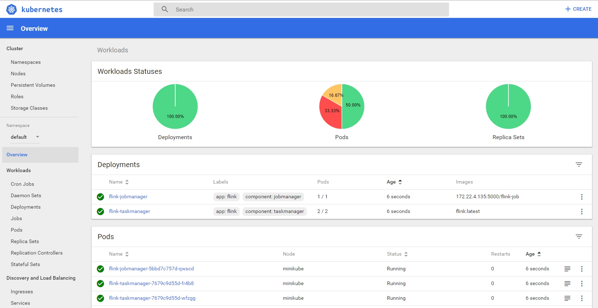
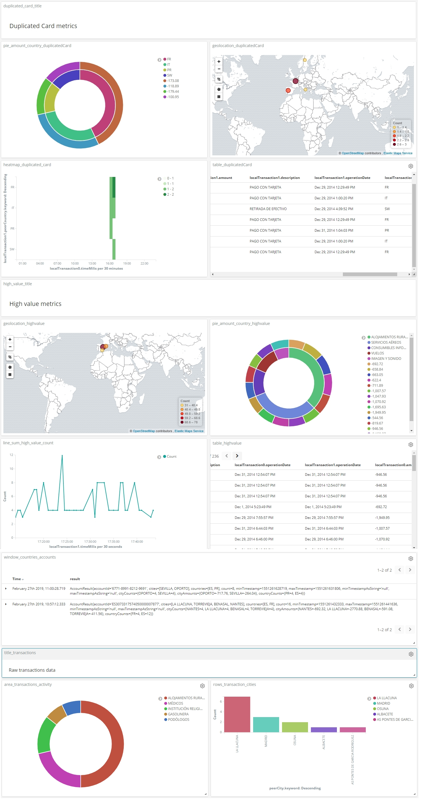
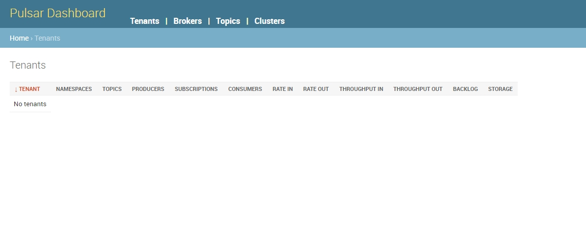

# Pulsar Flink k8s

## Project

Before putting something in production, You have to know about the capabilities and pitfalls of a technology. Here I want to evaluate Apache Pulsar, Flink and kubernetes together.

## Overview

The main purpouse is building an end to end from an Apache Pulsar subscription and a Flink pipeline with Elasticsearch and other
Pulsar topics as sinks. The use cases and business logic are slightly naive but related to fraud detection, duplicated cards, process transaction geolocations async and create some aggregations.

## Features

The main features and tasks made are:

- Use Flink AsyncIO for lazy REST requests with an external Geolocation service
- Use event time, tumbling windows and acummulators for user accounts to determine unusual payments
- Use some Complex Event Processing (CEP) with different aggregations with its own sinks for fraud detection and duplicated cards
- Use sideOutput to store log accounts data on a pulsar topic
- Use Pulsar functions instead of Flink engine to process data as a lambda function
- Use the Pulsar dashboard to monitor topic metrics
- Include an unbounded data streaming generator to emulate transaction traffic
- Use schema registry if necessary
- Deploy the Flink job on-premise at K8s Flink cluster

## Status

Pending:
- Kafka performance benchmark
- Deploy on GKE

## Prerequisites

- Java 8+
- Pulsar cluster service
- Elasticsearch service
- Transactions stream

## Building

Checkout the source code:

```
git clone https://github.com/jorgeakanieves/pulsar-flink-k8s.git
cd pulsar-flink
```

Build:

```
./gradlew
```

Install jar files into the local maven repository. This is handy for running locally against a local kubernetes cluster.

```
./gradlew install
```

Running unit tests:

```
./gradlew test
```

## Interfaces

### k8s pods



### kibana alerts dashboard for CEP sink and raw transactions



### Pulsar dashboard




## Contributing

Feel free to become a contributor by pull request

## About

https://www.linkedin.com/in/jorgenieves/

100% open source and community-driven

## Resources

Apache Flink https://github.com/apache/flink

Apache Pulsar http://pulsar.apache.org/docs/latest/getting-started/ConceptsAndArchitecture/


